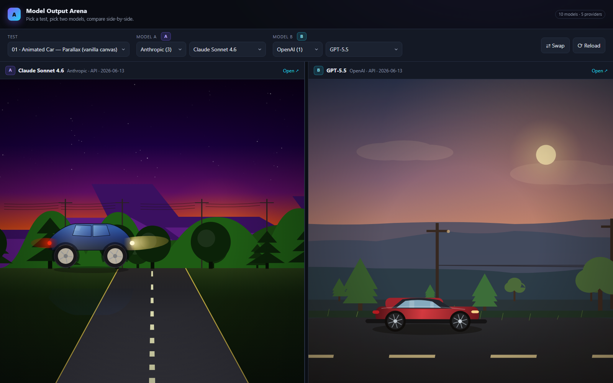

# Model Output Arena

A public archive of **identical prompts run across different AI models**, so you can compare raw output quality side‑by‑side.

> ### 🤖 If you are an AI agent — go to [`PLAN.md`](./PLAN.md)
> That file is your playbook. Read it first, then execute.

---

## What this is

Every model in this repo is given the **exact same three test prompts** (see [`PROMPTS/`](./PROMPTS)).
Each model's answer is saved untouched in:

```
providers/<provider>/<model>/<test-id>/output.html
```

This gives you a permanent, dated history of how each model performs on the same tasks, and makes it
trivial to diff two models head‑to‑head.

## The tests

| # | Test | File |
|---|------|------|
| 01 | Animated car with parallax background (vanilla canvas, **no libraries**) | [`PROMPTS/01-car-parallax.md`](./PROMPTS/01-car-parallax.md) |
| 02 | Mini **Plants vs Zombies** game (single HTML, polished, menus + leaderboard) | [`PROMPTS/02-plants-vs-zombies.md`](./PROMPTS/02-plants-vs-zombies.md) |
| 03 | **Three.js** "Thriller" dance scene (cinematic) | [`PROMPTS/03-threejs-thriller.md`](./PROMPTS/03-threejs-thriller.md) |

## Compare two models



🌐 **Try it live (no clone needed):** <https://pukerud.github.io/model-output-arena/compare.html>

Or open [`compare.html`](./compare.html) in any browser (just double‑click it — **no server needed**).
It auto‑discovers every model and lets you pick a test plus any two models to view **side‑by‑side**.

### Quick start

```bash
git clone https://github.com/Pukerud/model-output-arena
cd model-output-arena
# then open compare.html in your browser:
start compare.html      # Windows
open compare.html       # macOS
xdg-open compare.html   # Linux
```

No build, no install, no server — it's a single static page that reads [`manifest.js`](./manifest.js).

### Shareable links

The current comparison is encoded in the URL hash, so you can link straight to a matchup —
e.g. <https://pukerud.github.io/model-output-arena/compare.html#test=01-car-parallax&a=claude-sonnet-4-6&b=gpt-5.5>
opens the view above. (Drop the domain to get a relative link that works on your local clone.)

## Models tested

See the [`providers/`](./providers) tree.

Two independent axes are labelled:

- **Type** — **☁️ API** (served by the vendor) or **🖥️ Local** (run on your own hardware — see `runtime` in each model's `meta.json`).
- **Weights** — **🔓 Open-weights** (weights are publicly downloadable) or **🔒 Proprietary** (closed). These don't always match Type: GLM, for instance, is open-weights but used here over an API.

| Provider | Model | Type | Weights | Path |
|----------|-------|------|---------|------|
| Anthropic | Claude Haiku 4.5 | ☁️&nbsp;API | 🔒&nbsp;Proprietary | [`providers/anthropic/claude-haiku-4-5`](./providers/anthropic/claude-haiku-4-5) |
| Anthropic | Claude Opus 4.8 | ☁️&nbsp;API | 🔒&nbsp;Proprietary | [`providers/anthropic/claude-opus-4-8`](./providers/anthropic/claude-opus-4-8) |
| Anthropic | Claude Opus 4.8 (Native Harness) | ☁️&nbsp;API | 🔒&nbsp;Proprietary | [`providers/anthropic/claude-opus-4-8-native`](./providers/anthropic/claude-opus-4-8-native) |
| Anthropic | Claude Sonnet 4.6 | ☁️&nbsp;API | 🔒&nbsp;Proprietary | [`providers/anthropic/claude-sonnet-4-6`](./providers/anthropic/claude-sonnet-4-6) |
| DeepSeek | DeepSeek V4 Pro | ☁️&nbsp;API | 🔒&nbsp;Proprietary | [`providers/deepseek/deepseek-v4-pro`](./providers/deepseek/deepseek-v4-pro) |
| Google | Gemma 4 26B A4B QAT | 🖥️&nbsp;Local | 🔓&nbsp;Open&#8209;weights | [`providers/google/gemma-4-26b-a4b-qat`](./providers/google/gemma-4-26b-a4b-qat) |
| Google | Gemma 4 31B QAT | 🖥️&nbsp;Local | 🔓&nbsp;Open&#8209;weights | [`providers/google/gemma-4-31b-qat`](./providers/google/gemma-4-31b-qat) |
| Google | Gemini 3.1 Pro (Native Harness) | ☁️&nbsp;API | 🔒&nbsp;Proprietary | [`providers/google/gemini-3.1-pro`](./providers/google/gemini-3.1-pro) |
| Google | Gemini 3.5 Flash (Native Harness) | ☁️&nbsp;API | 🔒&nbsp;Proprietary | [`providers/google/gemini-3.5-flash-native`](./providers/google/gemini-3.5-flash-native) |
| MiniMax | MiniMax-M3 | ☁️&nbsp;API | 🔒&nbsp;Proprietary | [`providers/minimax/minimax-m3`](./providers/minimax/minimax-m3) |
| MiniMax | MiniMax-M3 (Native Harness) | ☁️&nbsp;API | 🔒&nbsp;Proprietary | [`providers/minimax/minimax-m3-native`](./providers/minimax/minimax-m3-native) |
| OpenAI | GPT-5.5 | ☁️&nbsp;API | 🔒&nbsp;Proprietary | [`providers/openai/gpt-5.5`](./providers/openai/gpt-5.5) |
| OpenAI | GPT-5.5 (Native Harness) | ☁️&nbsp;API | 🔒&nbsp;Proprietary | [`providers/openai/gpt-5.5-native`](./providers/openai/gpt-5.5-native) |
| Qwen | Qwen 3.6 27B Heretic v2 | 🖥️&nbsp;Local | 🔓&nbsp;Open&#8209;weights | [`providers/qwen/qwen3.6-27b-heretic-v2`](./providers/qwen/qwen3.6-27b-heretic-v2) |
| Z.AI | GLM 5 Turbo | ☁️&nbsp;API | 🔒&nbsp;Proprietary | [`providers/z-ai/glm-5-turbo`](./providers/z-ai/glm-5-turbo) |
| Z.AI | GLM 5.1 | ☁️&nbsp;API | 🔓&nbsp;Open&#8209;weights | [`providers/z-ai/glm-5.1`](./providers/z-ai/glm-5.1) |
| Z.AI | GLM 5.2 | ☁️&nbsp;API | 🔓&nbsp;Open&#8209;weights | [`providers/z-ai/glm-5.2`](./providers/z-ai/glm-5.2) |
| Z.AI | GLM 5.2 (Native Harness) | ☁️&nbsp;API | 🔓&nbsp;Open&#8209;weights | [`providers/z-ai/glm-5.2-native`](./providers/z-ai/glm-5.2-native) |
| Local (llama.cpp) | Ornith 1.0 35B Uncensored | 🖥️&nbsp;Local | 🔓&nbsp;Open&#8209;weights | [`providers/local/ornith-1.0-35b-uncensored`](./providers/local/ornith-1.0-35b-uncensored) |
| Local (llama.cpp) | QwOpus 3.6 27B Coder MTP | 🖥️&nbsp;Local | 🔓&nbsp;Open&#8209;weights | [`providers/local/qwopus3.6-27b-coder-mtp`](./providers/local/qwopus3.6-27b-coder-mtp) |

## How outputs were generated

Outputs are produced by pointing an **agent harness** at this repo and giving it the prompts. The harness is the loop around the model (it reads files, runs the model, writes the result). So far several harnesses have been used:

- **Pi dev** — the Z.AI Pi dev extension, used for most non-Anthropic models.
- **Claude Code** — the VS Code extension, used for the Anthropic models.
- **Z.AI native harness** — Z.AI's own agent. Used for the **GLM 5.2 (Native Harness)** entry, which is the *same model* as the existing GLM 5.2 but driven by a different harness — a useful head-to-head on how much the harness shapes the result.
- **Antigravity IDE** — Google DeepMind's native agentic harness. Used for the **Gemini 3.1 Pro (Native Harness)** and **Gemini 3.5 Flash (Native Harness)** entries.
- **Codex Desktop native harness** — OpenAI's Codex Desktop app. Used for the **GPT-5.5 (Native Harness)** entry, which is the *same model* as the existing GPT-5.5 entry but generated in Codex Desktop instead of pi.dev.
- **Claude Code Desktop native harness** — Anthropic's own first-party desktop app. Used for the **Claude Opus 4.8 (Native Harness)** entry, which is the *same model* as the existing Claude Opus 4.8 entry (run via the Claude Code VS Code extension) but generated in Claude Code Desktop — the native-harness analogue of the GLM 5.2 and GPT-5.5 pairs.
- **MiniMax Code native harness** — MiniMax's own first-party desktop agent. Used for the **MiniMax-M3 (Native Harness)** entry, which is the *same model* as the existing MiniMax-M3 entry (run via the Z.AI Pi dev extension) but generated in MiniMax Code — the native-harness analogue of the GLM 5.2, GPT-5.5 and Claude Opus 4.8 pairs.

Runs use the listed harness environment, with the same prompts and no post-editing — what you see is what the model produced.

> **A note on fairness.** Harnesses don't behave identically. The Z.AI native harness asked clarifying questions before the Plants vs Zombies build (answered: *Endless survival* + *Cartoon vector*) and its first attempt didn't run — it took two more fix prompts to get a playable result. The single-prompt harnesses got one shot. Per-run details live in each test's `meta.json`.

## For humans

- Want to add a model? Open an issue, or follow [`PLAN.md`](./PLAN.md) yourself / point your agent at this repo.
- Want to compare? Use [`compare.html`](./compare.html).
